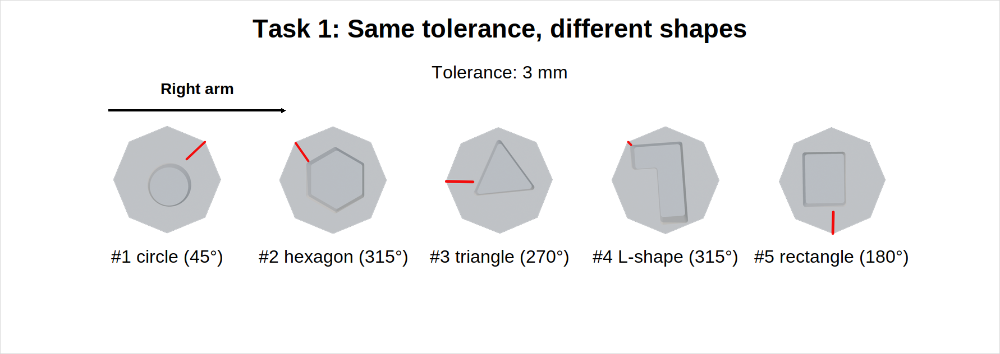

# Peg-in-Bench Scenario Generator

A Python-based tool for generating randomized assembly scenarios for a peg-in-hole benchmarking platform. This tool creates detailed task specifications with customizable pieces, tolerances, and orientations.

## Overview

The Peg-in-Bench system is designed to evaluate robotic and human assembly capabilities using modular puzzle-like pieces. The scenario generator creates randomized yet reproducible test scenarios with varying difficulty levels based on shape complexity, tolerance requirements, and piece orientations.

## Quick Start

### Prerequisites
- Python 3.7+
- PIL/Pillow (for image handling, optional)

### Installation

```bash
cd scripts
python Generate_Scenario.py --help
```

## Usage

### Basic Scenario Generation

Generate a random scenario with default settings:
```bash
python Generate_Scenario.py
```

### With Seed (Reproducible Scenarios)

Generate the same scenario repeatedly:
```bash
python Generate_Scenario.py --seed 12345
```

### With Custom Output

Save scenario to a specific file:
```bash
python Generate_Scenario.py --output my_scenario.json
```

### With Image Directory

Specify custom location for piece images:
```bash
python Generate_Scenario.py --image-dir /path/to/Photos
```

### Advanced Options

```bash
python Generate_Scenario.py \
  --seed 12345 \
  --output scenario.json \
  --image-dir Photos \
  --json-output
```

## Configuration

### Key Parameters in Code

**Shapes** (5 types):
- `triangle` - Basic triangular peg
- `rectangle` - Rectangular peg
- `circle` - Circular peg
- `hexagon` - Hexagonal peg
- `L-shape` - L-shaped connector

**Tolerances** (3 levels):
- `0.1 mm` - Tight tolerance (high difficulty)
- `1 mm` - Medium tolerance
- `3 mm` - Loose tolerance (low difficulty)

**Orientations** (8 possible):
- `0°, 45°, 90°, 135°, 180°, 225°, 270°, 315°`
- Diagonal (45°) orientations use separate image set from `Photos_45` folder

**Base Pieces** (for assembly scaffolding):
- `base` - Simple platform (4 connection ports)
- `corner-base` - Corner connector (2 ports, 2 joints)
- `line-base` - Linear connector (2 ports, 2 joints)
- `cross-base` - Cross junction (0 port, 4 joints)

## Output Format

Scenarios are generated as JSON files containing:

```json
{
  "task_id": 1,
  "name": "Same tolerance, different shapes",
  "description": "One tolerance with every shape in a fixed insertion order directed by arm arrow.",
  "tolerance": "3 mm",
  "peg_order": [
    "triangle",
    "hexagon",
    "L-shape",
    "circle",
    "rectangle"
  ],
  "arm_arrow": {
    "arm": "left",
    "arrow_side": "left",
    "arrow_direction": "right"
  },
  "placement_order": [
    "rectangle",
    "circle",
    "L-shape",
    "hexagon",
    "triangle"
  ],
  "orientations": {
    "triangle": "0\u00b0",
    "hexagon": "0\u00b0",
    "L-shape": "90\u00b0",
    "circle": "135\u00b0",
    "rectangle": "315\u00b0"
  },
  "notes": [
    "Order is established before data collection and kept during execution.",
    "Use one peg per shape in the chosen fixed order.",
    "The arm arrow indicates which arm to use and the direction of insertion."
  ],
  "scenario_seed": 1
}
```

## STL Files Directory Structure

The `STL Files/` folder contains 3D models for 3D printing and CAD:

### Directory Organization

```
STL Files/
├── Additional pieces/          # Supplementary connector pieces
│   └── Fixing pieces and Peg-holder
├── Bases/                      # Foundation/platform pieces
│   ├── base.stl
│   ├── corner-base.stl
│   ├── line-base.stl
│   └── cross-base.stl
├── Pegs/                      
│   ├── circle/
│   ├── triangle/
│   ├── rectangle/
│   ├── hexagon/
│   └── L-shape/
└── Shaped-holes/              # Receiving shaped-hole pieces
    ├── 0.1mm/                 # Tight tolerance
    │   ├── circle_0.1mm.stl
    │   ├── triangle_0.1mm.stl
    │   ├── rectangle_0.1mm.stl
    │   ├── hexagon_0.1mm.stl
    │   └── L-shape_0.1mm.stl
    ├── 1mm/                   # Medium tolerance
    │   └── [Shape files]
    └── 3mm/                   # Loose tolerance 
        └── [Shape files]
```

### STL File Descriptions

**Bases**
- Foundation pieces that hold the shaped-holes or act as assembly components
- Each base has connection ports that match other pieces
- Used to create fixed or semi-fixed assembly scaffolds

**Pegs** (Insertable pieces)
- 5 different shapes: circle, triangle, rectangle, hexagon, L-shape
- Available in various sizes and orientations

**Shaped Holes** (Receiving cavities)
- Precision-manufactured holes matching each peg shape
- Available in 3 tolerance levels:
  - **0.1mm** - Extremely tight fit, tests precision
  - **1mm** - Standard assembly tolerance
  - **3mm** - Loose tolerance for ease of insertion
- Each tolerance level contains all 5 shapes
- Can be rotated inside the bases (0°, 90°, 180°, 270°, 45°, 135°, 225°, 315°)

### Tolerance Levels Explained

- **0.1mm**: Requires high precision, minimal play
- **1mm**: Standard engineering tolerance, typical assembly
- **3mm**: Forgiving tolerance, easy insertion but less precision

## Image Assets

### Photos/ Directory
Contains PNG images of each peg shape at different tolerances:
- `Circle_0.1.png`, `Circle_1.png`, `Circle_3.png`
- `Triangle_0.1.png`, `Triangle_1.png`, `Triangle_3.png`
- `Rectangle_0.1.png`, `Rectangle_1.png`, `Rectangle_3.png`
- `Hexagon_0.1.png`, `Hexagon_1.png`, `Hexagon_3.png`
- `L-Shape_0.1.png`, `L-Shape_1.png`, `L-Shape_3.png`
- Base piece images: `base.png`, `corner-base.png`, `line-base.png`, `cross-base.png`

### Photos_45/ Directory
Same images rotated/optimized for 45° diagonal orientations:
- `Circle_0.1_45.png`, `Circle_1_45.png`, `Circle_3_45.png`
- `Triangle_0.1_45.png`, `Triangle_1_45.png`, `Triangle_3_45.png`
- `Rectangle_0.1_45.png`, `Rectangle_1_45.png`, `Rectangle_3_45.png`
- `Hexagon_0.1_45.png`, `Hexagon_1_45.png`, `Hexagon_3_45.png`
- `L-Shape_0.1_45.png`, `L-Shape_1_45.png`, `L-Shape_3_45.png`

## Key Features

- **Reproducible Generation**: Use seeds to recreate exact scenarios
- **Multiple Difficulty Levels**: Varying tolerances and shape complexity
- **Flexible Orientations**: 8 possible angles with diagonal awareness
- **Visual Feedback**: PNG images for all piece types and tolerances
- **Assembly Constraints**: Validates piece connectivity for base configurations
- **Grid-Based Placement**: 3x3 grid for systematic piece placement

## Assembly System

The tool includes logic for validating piece connections:

**Connector Types**:
- `joint` - Protrusion that connects into a hole
- `hole` - Cavity that receives a joint
- `none` - No connector

**Connection Rules**:
- Joints must connect to holes (one-to-one mapping)
- Opposite sides have complementary connectors
- Base pieces have fixed connector patterns

## GUI Functionality

The scenario generator includes an interactive graphical interface for visual scenario configuration and preview.

### Launching the GUI

```bash
python Generate_Scenario.py --gui
```

### GUI Components

#### Main Window Layout


> Screenshot: Main scenario generator interface with controls and preview

#### Task 1 Configuration Panel

The **Task 1** panel is seed-driven: instead of manually selecting each shape and orientation, you provide a numeric **seed**, choose the **tolerance** level, and select the executing **arm** (left, right, or either). The seed deterministically generates the set of shapes, their orientations, and grid positions shown in the preview — this is the workflow used for the examples below.

**Task 1 Parameters (GUI)**:

| Parameter | Options | Description |
|-----------|---------|-------------|
| **Seed** | Integer | Deterministic generator seed — selects the shapes, orientations, and positions for Task 1 |
| **Tolerance** | 0.1 mm, 1 mm, 3 mm | Fixes the tolerance for all pieces in Task 1 (controls insertion difficulty) |
| **Arm** | left, right, either | Which robot arm is assigned; affects task ordering and left/right layout cues |


> Example: Task 1 generated from a single seed with the same tolerance applied across different shapes (left-arm assignment shown)

#### GUI Main Window — annotated (image explained)

The attached image shows a typical Task 1 preview generated by the GUI. Key elements and their meanings:

- **Top-left title**: `Task 1: Same tolerance, different shapes` — a short description of the task template or test family being previewed.
- **Central scenario header**: `Scenario "1"` — the generated scenario identifier. Useful when paging through or saving multiple scenarios.
- **Tolerance display**: `Tolerance: 3 mm` — the chosen Task 1 tolerance; in this GUI mode tolerance is a single selection that applies to all generated pieces for the task.
- **Arm indicator**: `Left arm` with an arrow — shows which robot arm (left/right) will perform the insertion sequence and the left→right ordering of piece insertions shown below.
- **Piece preview row**: a horizontal sequence of piece renderings (five in this example). Each preview tile contains:
  - the visual silhouette of the shaped-hole and peg
  - a short red marker showing the insertion side/approach vector
  - an index and caption (for example `#1 triangle (0°)`) showing the generated order, shape name, and orientation in degrees
- **Order and semantics**: the numbered labels indicate the deterministic insertion order produced from the selected seed. In the example, piece `#1` is inserted first by the left arm, then `#2`, and so on.

This image is a canonical example of how the GUI communicates a seed-driven Task 1: the author sets `Seed + Tolerance + Arm`, the GUI renders the deterministic sequence, and the user confirms & exports the resulting scenario.


### Generating Scenarios with Task 1 Parameters

Once Task 1 is defined by a seed + tolerance + arm selection, the GUI deterministically produces the pieces and layout for that task. Use one of the flows below to create, export, or batch-generate scenarios.n

1. **Open GUI**: `python Generate_Scenario.py --gui`
2. **Configure Task 1**:
   - Enter a numeric **Seed** (integer)
   - Choose **Tolerance** (0.1 mm / 1 mm / 3 mm)
   - Choose **Arm** (left, right, either)
3. **Preview**: The preview will render the shapes, orientations and grid locations derived from the seed
4. **Generate**: Click "Generate Scenario" to build the scenario
5. **Save**: Save scenario to JSON or export the Task 1 template


### GUI Interactive Features

**Validation:**
- GUI prevents invalid parameter combinations
- Warns if images unavailable for selected configuration
- Checks base-piece compatibility

**Export Options:**
- Save scenario as JSON
- Export Task 1 configuration template
- Generate multiple variations from current config

### Troubleshooting GUI Issues

**GUI won't load:**
- Ensure tkinter is installed: `python -m tkinter`

**Images not showing in preview:**
- Verify Photos/ directory exists in same location as script
- Check image file naming matches expected format

**Parameter combinations invalid:**
- Some base types may not support all piece orientations
- GUI will indicate incompatible selections

## Troubleshooting

**Images not found**: Ensure image directory structure matches expected layout
```
Photos/
├── Circle_0.1.png
├── Circle_1.png
├── Triangle_0.1.png
└── ...
```

**No valid layouts found**: Check that base connection mappings are compatible

**Seed not reproducing**: Ensure using same Python version and random seed
